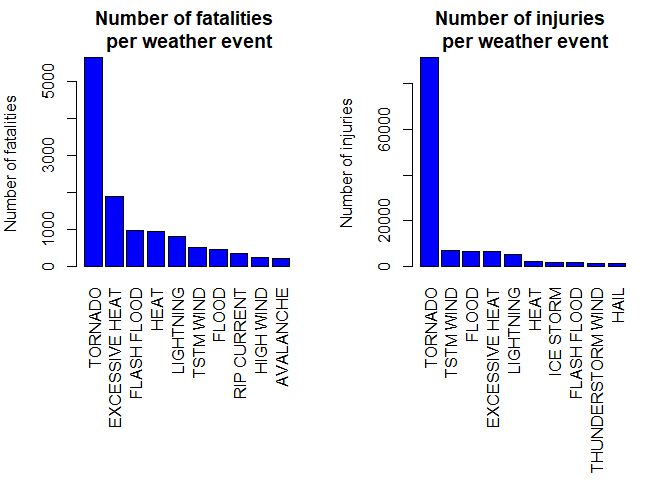
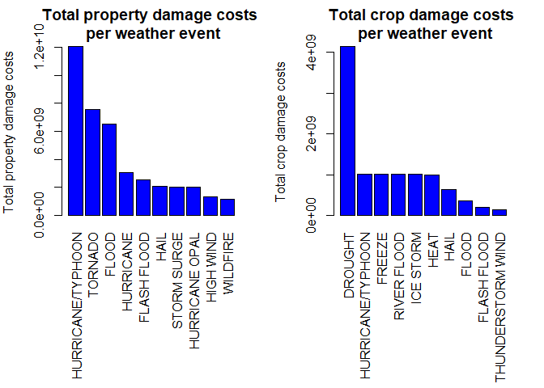

## Synopsis

In this project, the U.S. National Oceanic and Atmospheric Administration's (NOAA) storm database were analysed. It was found that tornadoes cause the most fatalities, and also leaves more injured. For the economic impact assessment, typhoons cause more property damage, but drought causes more crop damage.


## Data processing

The data processing steps were the following:

1. Read the .bz2 file as CSV
2. Select the adequate columns to answer the questions
3. Aggregate the storm types with the sum of the fatalities and injuries, in separate tables


```r
library(dplyr)
library(ggplot2)

datastorm <- read.csv("repdata_data_StormData.csv.bz2", header = TRUE)
datastormcol <- select(datastorm, EVTYPE, FATALITIES, INJURIES, PROPDMG, PROPDMGEXP, CROPDMG, CROPDMGEXP)

stormfatalities <- arrange(aggregate(FATALITIES ~ EVTYPE, data = datastormcol, sum), desc(FATALITIES))

storminjuries <- arrange(aggregate(INJURIES ~ EVTYPE, data = datastormcol, sum), desc(INJURIES))
```

4. Transform the exponencials "M","K","B","k" to 1e6,1e3,1e9,1e3, respectively. The numbers n were transformed to the exponential 10^n. Every other index set to 1.

5. ggregate the storm types with the sum of the property and crop damages, in separate tables.


```r
datastormcol$propmult <- rep(1)
for(j in 1:nrow(datastormcol)) {
  
  if(datastormcol$PROPDMGEXP[j] %in% as.character(c(1:8))) {
    datastormcol$propmult[j] <- 10^(as.integer(datastormcol$PROPDMGEXP[j]))
  }
  if(datastormcol$PROPDMGEXP[j] == "B") {
    datastormcol$propmult[j] <- 1e9
  }
  if(datastormcol$PROPDMGEXP[j] == "h") {
    datastormcol$propmult[j] <- 1e2
  }
  if(datastormcol$PROPDMGEXP[j] == "H") {
    datastormcol$propmult[j] <- 1e2
  }
  if(datastormcol$PROPDMGEXP[j] == "K") {
    datastormcol$propmult[j] <- 1e3
  }
  if(datastormcol$PROPDMGEXP[j] == "m") {
    datastormcol$propmult[j] <- 1e6
  }
  if(datastormcol$PROPDMGEXP[j] == "M") {
    datastormcol$propmult[j] <- 1e6
  }
}

stormpropdamage <- arrange(aggregate(propmult ~ EVTYPE, data = datastormcol, sum), desc(propmult))

datastormcol$cropmult <- rep(1)
for(j in 1:nrow(datastormcol)) {
  
  if(datastormcol$CROPDMGEXP[j] %in% as.character(c(1:8))) {
    datastormcol$cropmult[j] <- 10^(as.integer(datastormcol$CROPDMGEXP[j]))
  }
  if(datastormcol$CROPDMGEXP[j] == "B") {
    datastormcol$cropmult[j] <- 1e9
  }
  if(datastormcol$CROPDMGEXP[j] == "h") {
    datastormcol$cropmult[j] <- 1e2
  }
  if(datastormcol$CROPDMGEXP[j] == "H") {
    datastormcol$cropmult[j] <- 1e2
  }
  if(datastormcol$CROPDMGEXP[j] == "K") {
    datastormcol$cropmult[j] <- 1e3
  }
  if(datastormcol$CROPDMGEXP[j] == "m") {
    datastormcol$cropmult[j] <- 1e6
  }
  if(datastormcol$CROPDMGEXP[j] == "M") {
    datastormcol$cropmult[j] <- 1e6
  }
}

stormcropdamage <- arrange(aggregate(cropmult ~ EVTYPE, data = datastormcol, sum), desc(cropmult))
```


## Results

To compare which storm type caused the most human impact, a barplot for the fatalities and a barplot for the injuries were plotted.
The number of injuries is important to evaluate the impact on the health system. The results show that tornadoes cause the most fatalities, and also leaves more injured.


```r
par(mfrow = c(1,2), mar = c(11, 4, 3, 2))
with(head(stormfatalities, n = 10), barplot(FATALITIES, names.arg = EVTYPE, las = 3, col  = "blue", 
                                            ylab = "Number of fatalities", main = "Number of fatalities \n per weather event"))
with(head(storminjuries, n = 10), barplot(INJURIES, names.arg = EVTYPE, las = 3, col  = "blue", 
                                          ylab = "Number of injuries", main = "Number of injuries \n per weather event"))
```

<!-- -->


To compare which storm type caused the economic impact, a barplot for the property damage and a barplot for the crop damage were plotted.
The results show that typhoons cause more property damage, but drought causes more crop damage.


```r
par(mfrow = c(1,2),mar = c(11, 4, 3, 2))
with(head(stormpropdamage, n = 10), barplot(propmult, names.arg = EVTYPE, las = 3, 
                                            ylab = "Total property damage costs", col  = "blue", 
                                            main = "Total property damage costs \n per weather event"))
with(head(stormcropdamage, n = 10), barplot(cropmult, names.arg = EVTYPE, las = 3, 
                                            ylab = "Total crop damage costs", col  = "blue", 
                                            main = "Total crop damage costs \n per weather event"))
```

<!-- -->
